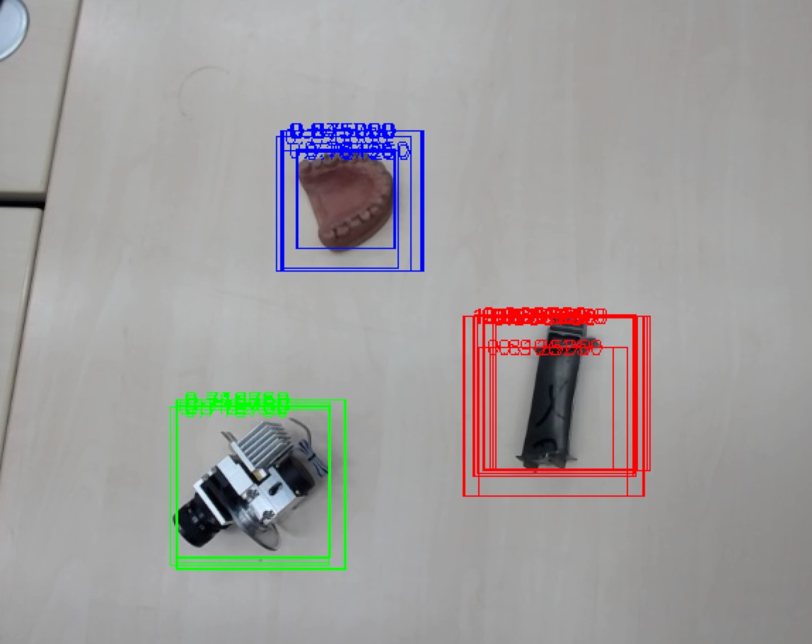

# TDCV Exercise 2: Object Detection

Yehya Abouelnaga, Balamurugan Thambiraja, Kamel Guerda


__Supervised By:__

Dr. Slobodan Ilic<br/>
Tracking & Detection in Computer Vision<br/>
Technical University of Munich (TUM)<br/>
WS 2017/18

## Introduction


## Pipeline
<p style='text-align: center;'>
  
</p>

## Compile The Code

In order to build the project, you need to run:
```
make
```

That shall yield in three different executables for each part of the assignments:
```
./task1
./task2
./task3
```

## Resources:

### BBox Generation: Selective Search
1. https://github.com/watanika/selective-search-cpp
2. https://www.learnopencv.com/selective-search-for-object-detection-cpp-python/

### Classification Accuracy Evaluation
1. https://github.com/ashokpant/accuracy-evaluation-cpp
